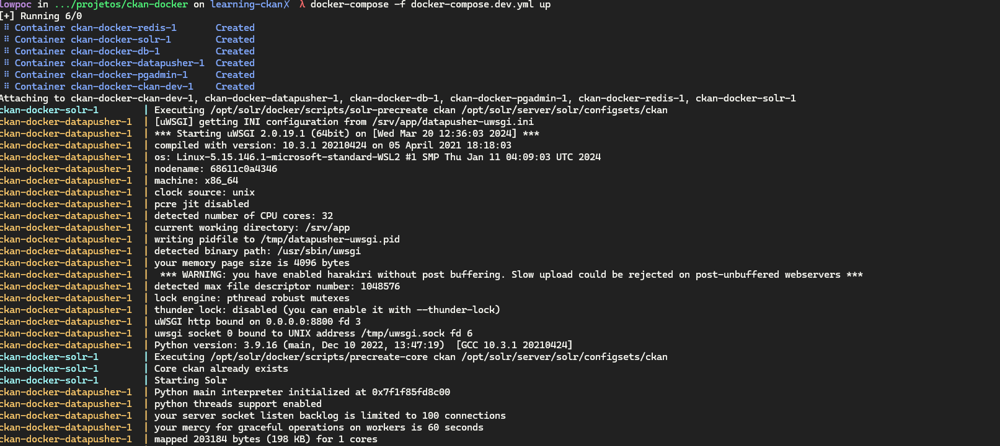

## Tutorial para instalação do CKAN utilizando o docker + wsl2

### Aluno: Marcus Vinicius Santana Silva
### Turma: 2024.1 - TÓPICOS AVANÇADOS EM ENGENHARIA DE SOFTWARE E SISTEMAS DE INFORMAÇÃO I - Turma 01 2024.1

#### Passos:

1. Utilizando o ambiente Windonws com WSl 2 podemos utilizar o modelo de container docker através do projeto https://github.com/ckan/ckan-docker disponibilizado pela documentação oficial do ckan 

2. Vamos dar o fork do projeto no github e realizar o seu clone na sua maquina.
2.1 
2.2 realizamos o clone do projeto em nossa maquina `gh repo clone MarcusViniciusSS/ckan-docker`
3. Agora vamos compor nosso ambiente para trabalho local e desenvolvimento do projeto, primeiro vamos fazer uma copia do arquivo. `.env.example -> .env`, feito isso vamos atualizar algumas variaveis para de configuração.
3.1 Por padrão em ambiente dev  o ckan sobe o nginx na porta 8843, então para termos todos os comportamentos na ui corretamente, vamos alterar a variavel CKAN_SITE_URL=http://localhost:5000 , assim vamos ter todos os redicionamento 
correto.
4. vamos adicionar dentro do arquivo docker-compose.dev.yml o pgadmin, ele nos ajudará ter um visão administrativa das nossas bases.
4.1 Basta adicionar.

4.2 vamos liberar a porta do postgre para ser visivel em ambiente externo.

5. Agora vamos executar o comando docker-compose -f docker-compose.dev.yml up

5.1 ao finalizar a subida podemos ver disponibilizado o painel do ckan na rota localhost:5000  e localhost:16543 para o painel do pgadmin.
5.2 validando se todos os container estão running, basta executar o comando `docker container ls`

6. acessando painel ckan, o usuário padrão utilizado está nas variveis .env
CKAN_SYSADMIN_PASSWORD=test1234
CKAN_SYSADMIN_EMAIL=your_email@example.com

7. Criando novo usuário, vamos acessar nosso container que tem o ckan cli e executar o comando docker exec -it <container-id> ckan -c ckan.ini user add admin email=admin@localhost

 
7.1 agora podemos acessar com esse cara no painel, utilizando login como novoadmin e senha 12345678

8. acessando nosso painel do pgadmin vamos acessar nossa base e ver todos os usuários existentes, o login e senah está no arquivo docker compose nas variaveis PGADMIN_DEFAULT_EMAIL & PGADMIN_DEFAULT_PASSSWORD

9. Disponibilizando seu projeto através do [ngrok](https://ngrok.com/), precisamos primeiramente criar uma conta através do site.

9.1 Criada conta, vamos seguir o passado a passo do Quickstart  https://ngrok.com/docs/getting-started/ , ao final vamos conseguir disponibilizar na rede nosso projeto ckan.

9.2 Cria o token de acesso através do painel disponibilizado.
 

9.3 Configurando o token 

9.4 disponibilizado com ngrok, rodando o comando ``ngrok http http://localhost:5000``, utilizamos a porta 5000 por ser a porta que o ckan nos dar, agora podemos acessar via forwarding o nosso app.

9.5 lembrando se queremos que o app redirect para o dns do ngrok precisamos atualizar o .env para o dns nos dado, trocando a variavel CKAN_SITE_URL para ``https://189e-2804-5dc-46-3848-7402-8f80-57a7-150.ngrok-free.app``

e agora é ser feliz. OBRIGADO!