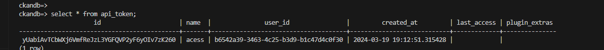
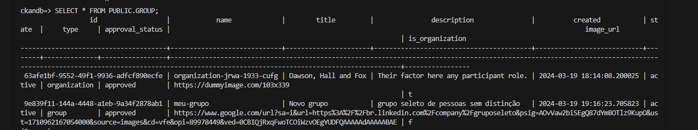

1. executa o comando docker-compose up  (possibilitar a subida de um ambiente docker com suas images respectivas)
2. para acessar o cli do ckan e utilizar todos os recursos disponiveis, docker exec -it <container_name> bash, assim teremos acesso ao bash do container
3. para criar um usuário utilizei o comando. ckan -c ckan.ini sysadmin add marcusvinicius email=lowpoc.developer@gmail.com name=marcusvinicius
4. par agerar dado fake, podemos utilizar o cli do ckan. ckan -c /etc/ckan/default/ckan.ini generate fake-data organization:

{"approval_status": "approved", "created": "2024-03-19T18:14:08.200025", "description": "Their factor here any participant role.", "display_name": "Dawson, Hall and Fox", "id": "63afe1bf-9552-49f1-9936-adfcf890ecfe", "image_display_url": "https://dummyimage.com/103x339", "image_url": "https://dummyimage.com/103x339", "is_organization": true, "name": "organization-jrwa-1933-cufg", "num_followers": 0, "package_count": 0, "state": "active", "title": "Dawson, Hall and Fox", "type": "organization", "users": [{"about": null, "activity_streams_email_notifications": false, "capacity": "admin", "created": "2024-03-19T18:01:27.365600", "display_name": "default", "email_hash": "d41d8cd98f00b204e9800998ecf8427e", "fullname": null, "id": "0ae332ac-f1ad-4c18-9665-9b708f7010a4", "image_display_url": null, "image_url": null, "last_active": null, "name": "default", "number_created_packages": 0, "state": "active", "sysadmin": true}], "extras": [], "tags": [], "groups": []}

5. Criando o dataset fake para orgnaização: ckan -c ckan.ini generate fake-data dataset --title="My Test database mocking" --owner_org=63afe1bf-9552-49f1-9936-adfcf890ecfe

 {"author": null, "author_email": null, "creator_user_id": "0ae332ac-f1ad-4c18-9665-9b708f7010a4", "id": "5fda32af-f9f0-4a40-ad3e-a2d2c2a860be", "isopen": false, "license_id": null, "license_title": null, "maintainer": null, "maintainer_email": null, "metadata_created": "2024-03-19T18:14:45.806966", "metadata_modified": "2024-03-19T18:14:45.806970", "name": "dataset-vswm-8804-ynmm", "notes": "Organization current some truth remain weight.", "num_resources": 0, "num_tags": 0, "organization": {"id": "63afe1bf-9552-49f1-9936-adfcf890ecfe", "name": "organization-jrwa-1933-cufg", "title": "Dawson, Hall and Fox", "type": "organization", "description": "Their factor here any participant role.", "image_url": "https://dummyimage.com/103x339", "created": "2024-03-19T18:14:08.200025", "is_organization": true, "approval_status": "approved", "state": "active"}, "owner_org": "63afe1bf-9552-49f1-9936-adfcf890ecfe", "private": false, "state": "active", "title": "My Test database mocking", "type": "dataset", "url": null, "version": null, "resources": [], "tags": [], "extras": [], "groups": [], "relationships_as_subject": [], "relationships_as_object": []}

 6.  Criando api token SELECT datname AS "Database",
       pg_size_pretty(pg_database_size(datname)) AS "Size"
FROM pg_database;

7. Acessando os dados do grupo!

